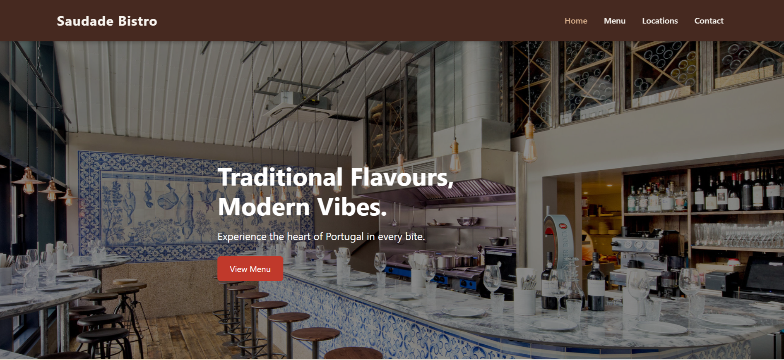

# 🇵🇹 Saudade Bistro – Restaurant Website

A responsive multi-page restaurant website built using HTML, CSS, JavaScript, and Bootstrap.

## 📌 Project Overview

This project was created as part of my software development bootcamp.
It showcases a modern Portuguese restaurant website with multiple pages and interactive features.

## 🚀 Features

* Responsive design using Bootstrap
* Multi-page layout (Home, Menu, Locations, Contact)
* Styled hero sections with background images
* Interactive contact form with JavaScript validation
* Embedded Google Maps for restaurant locations
* Custom CSS styling and theming

## 🛠️ Technologies Used

* HTML5
* CSS3
* JavaScript (DOM manipulation)
* Bootstrap 5

## 📸 Screenshots

## ▶️ How to Run

1. Download or clone the repository
2. Open `index.html` in your browser

## 📚 What I Learned

* Building responsive layouts with Bootstrap
* Structuring multi-page websites
* Using JavaScript for form validation
* Working with the DOM and event listeners
* Improving UI/UX with styling and layout

## 👤 Author

Scott Carey
